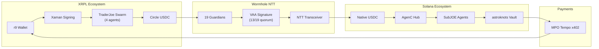

## Cross-Chain Bridge Flow (XRPL → Solana)

The OPTX bridge connects XRPL and Solana ecosystems through Wormhole NTT with native USDC burn/mint — no wrapped tokens.

## Pipeline Stages

### 1. XRPL Entry
- **r9 Wallet**: Primary XRPL wallet with XRP + RLUSD + USDC
- **Xaman Signing**: All transactions signed via Xaman (no seed exposure)
- **TraderJoe Swarm**: 4 autonomous trading agents (passive LP, lag monitor, Hooks rebalancing, grid trading)

### 2. Wormhole NTT Bridge
- **19 Guardian Nodes**: Validate cross-chain messages
- **13/19 Quorum**: Required for VAA signature verification
- **NTT Transceiver**: Custom OPTX transceiver with `jett_vault` PDA
- **Native USDC**: Burn on source chain, mint on destination — no wrapped tokens

### 3. Solana Settlement
- **AgenC Hub**: Coordinates SubJOE agents for DeFi operations
- **MetaplexJOE Registry**: On-chain agent identity via Metaplex Core Assets
- **Helius Webhooks**: Real-time monitoring of on-chain events
- **astroknots Vault**: Primary DApp for staking and yield aggregation

### 4. Payment Loop
- **MPO Tempo x402**: Agent-to-agent payments via Circle USDC
- Revenue flows back to XRPL wallet, completing the loop

## TraderJoe Swarm (4 Agents)

| Agent | Strategy | Role |
|-------|----------|------|
| TraderJoe1 | Passive LP | Liquidity provision with auto-compounding |
| TraderJoe2 | Lag Monitor | 30s oracle monitoring, latency detection |
| TraderJoe3 | Hooks | Xahau Hooks rebalancing (paper mode) |
| TraderJoe4 | Grid | 6% range, 10-level grid trading |

## Related
- [Cockpit: Bridge Overview](/docs/cockpit) — Live dashboard view
- [Infrastructure: LayerZero Bridge](/docs/infrastructure/bridge) — Technical details
