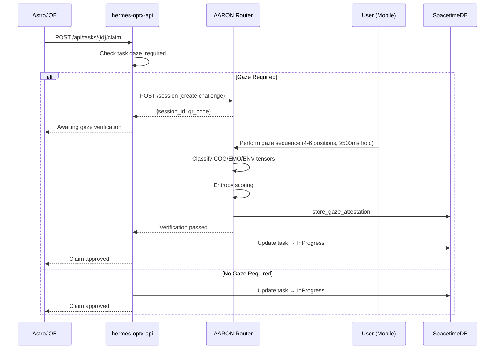

## Gaze-Gated Policy Enforcement

Tasks flagged with `gaze_required: true` require biometric verification before an agent can claim them.

## AGT Tensor Classification

The AARON Router classifies iris landmarks (MediaPipe FaceLandmarker 468/473) into three Agentive Gaze Tensor (AGT) types:

| Tensor | Name | Pattern | Meaning |
|--------|------|---------|---------|
| **COG** | Cognitive | Focused, intentional gaze | Task execution, concentration |
| **EMO** | Emotional | Micro-expression correlated | Sentiment, affect, stress |
| **ENV** | Environmental | Peripheral, scanning | Spatial awareness, context |

## Verification Flow

1. **Session Creation**: AARON generates a session ID and QR challenge
2. **Gaze Sequence**: User performs 4-6 gaze positions, holding each ≥500ms
3. **Tensor Classification**: AARON classifies each position into COG/EMO/ENV
4. **Entropy Scoring**: Measures randomness/uniqueness of the gaze pattern (0-1585 range)
5. **Attestation**: Results stored in SpacetimeDB `gaze_attestation` table with hash, entropy, and verification status

## When Gaze is Required

- High-value task operations (reward > threshold)
- Sensitive data access
- Agent wallet transactions
- Policy changes
- Any task with `gaze_required: true`

## Related
- [AARON Protocol](/docs/protocol) — Full protocol documentation
- [Gaze Verification Guide](/docs/authentication/gaze) — Implementation guide
