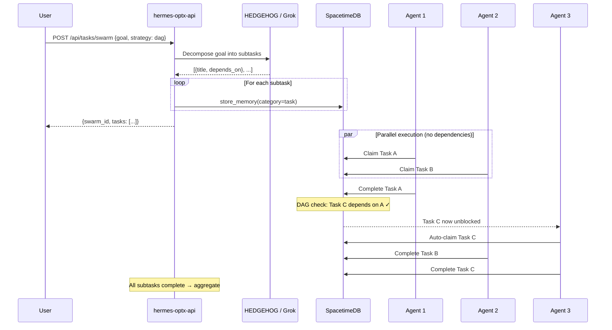

## Swarm Decomposition (DAG Workflow)

Complex goals are decomposed into subtasks using Grok, then executed as a Directed Acyclic Graph (DAG) by multiple agents.



## Strategies

### Parallel
All subtasks created with no dependencies. Every agent can claim immediately.

```json
{ "goal": "...", "strategy": "parallel", "agent_count": 4 }
```

### Sequential
Each subtask depends on the previous one. Forms a linear chain.

```json
{ "goal": "...", "strategy": "sequential", "agent_count": 1 }
```

### DAG (Directed Acyclic Graph)
Grok analyzes the goal and creates subtasks with explicit dependency links. Tasks without dependencies start immediately; blocked tasks wait.

```json
{ "goal": "...", "strategy": "dag", "agent_count": 3 }
```

## Dependency Resolution

When a task completes:
1. Orchestrator queries all tasks with `depends_on` containing the completed task ID
2. For each dependent task, checks if **all** its dependencies are `Completed`
3. If yes and an agent is pre-assigned, auto-transitions to `Claimed`
4. If yes and no agent assigned, transitions to `Open` for discovery

## Example: Research Swarm

**Goal**: "Research OPTX competitors, analyze their tokenomics, and draft a comparison report"

**Grok decomposes into**:
- Task A: "Research competitor projects on Solana" (no deps)
- Task B: "Analyze DePIN token models" (no deps)
- Task C: "Draft comparison report" (depends on A, B)

Tasks A and B execute in parallel. Task C waits until both complete, then auto-starts.

## Related
- [Task Lifecycle](/docs/architecture/task-lifecycle) — Single task flow
- [Task State Machine](/docs/architecture/task-states) — All possible states
