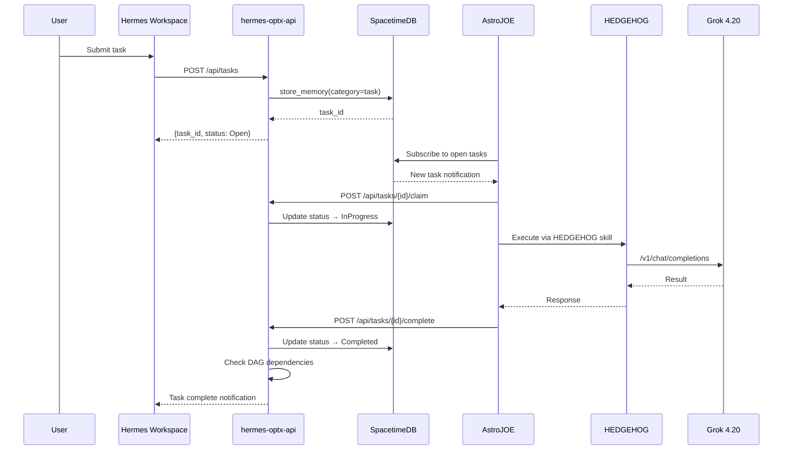

## Task Lifecycle (Happy Path)

The complete success workflow from user request through agent execution to result storage.

## Key Concepts

### Task Discovery
AstroJOE discovers tasks by subscribing to SpacetimeDB's `memory_entry` table filtered by `category = "task"` and `status = "Open"`. SpacetimeDB's subscription model delivers real-time notifications without polling.

### Claim Validation
When an agent claims a task, the API validates:
1. Task exists and is in `Open` status
2. Agent has required capabilities (if specified)
3. Gaze verification is satisfied (if `gaze_required = true`)
4. Policy constraints are met

### Execution
The agent uses its SKILL.md tools to execute — typically via HEDGEHOG for AI reasoning, SpacetimeDB for data retrieval, or AARON for gaze operations.

### DAG Resolution
On completion, the orchestrator checks if this task unblocks any dependent tasks. If all dependencies for a waiting task are `Completed`, it auto-transitions to `Claimed` for the assigned agent.

## Related
- [Swarm Decomposition](/docs/architecture/swarm-dag) — Multi-agent DAG workflows
- [Gaze-Gated Policy](/docs/architecture/gaze-policy) — Biometric verification gate
- [Task Orchestration](/docs/astrojoe/orchestration) — API reference
