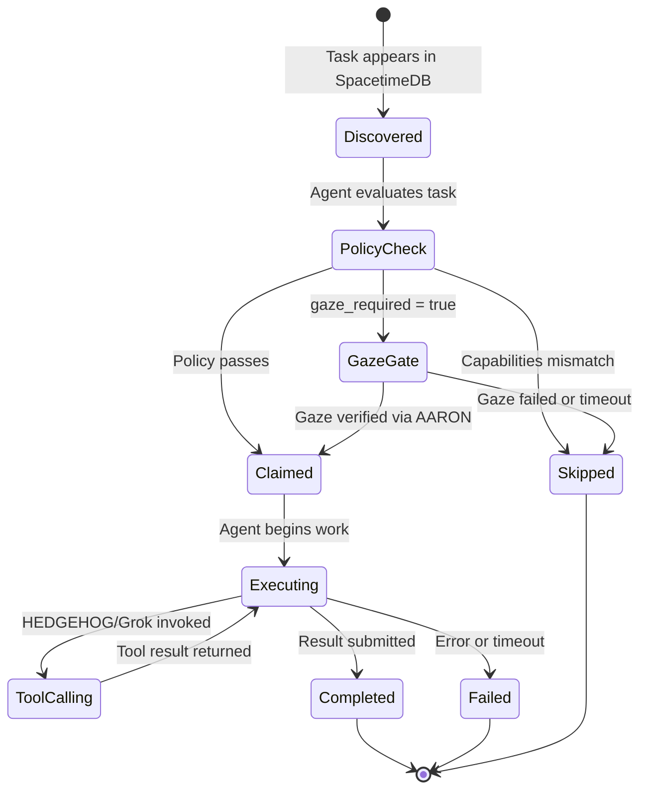

## Task Execution State Machine

## States

| State | API Status | Description |
|-------|-----------|-------------|
| **Discovered** | `Open` | Task created, visible to agents |
| **PolicyCheck** | `Open` | Agent evaluating capabilities and policy |
| **GazeGate** | `Open` | Awaiting AARON gaze verification |
| **Skipped** | `Open` | Agent passed on this task (stays open for others) |
| **Claimed** | `InProgress` | Agent has claimed and is executing |
| **Executing** | `InProgress` | Active work in progress |
| **ToolCalling** | `InProgress` | HEDGEHOG/Grok invoked for AI reasoning |
| **Completed** | `Completed` | Result submitted, task done |
| **Failed** | `Failed` | Error, timeout, or execution failure |
| **Cancelled** | `Cancelled` | Manually cancelled by creator |

## Transitions

### Open → Claimed
- Agent calls `POST /api/tasks/{id}/claim`
- API validates capabilities, policy, gaze (if required)

### Claimed → Completed
- Agent calls `POST /api/tasks/{id}/complete` with result data
- Orchestrator checks DAG dependencies and unblocks waiting tasks

### Claimed → Failed
- Execution error, timeout, or agent crashes
- Task can be retried by another agent

### Open → Cancelled
- Creator calls `DELETE /api/tasks/{id}`
- Terminal state, cannot be reopened

## Related
- [Task Lifecycle](/docs/architecture/task-lifecycle) — Happy path sequence
- [Swarm Decomposition](/docs/architecture/swarm-dag) — Multi-agent DAG
