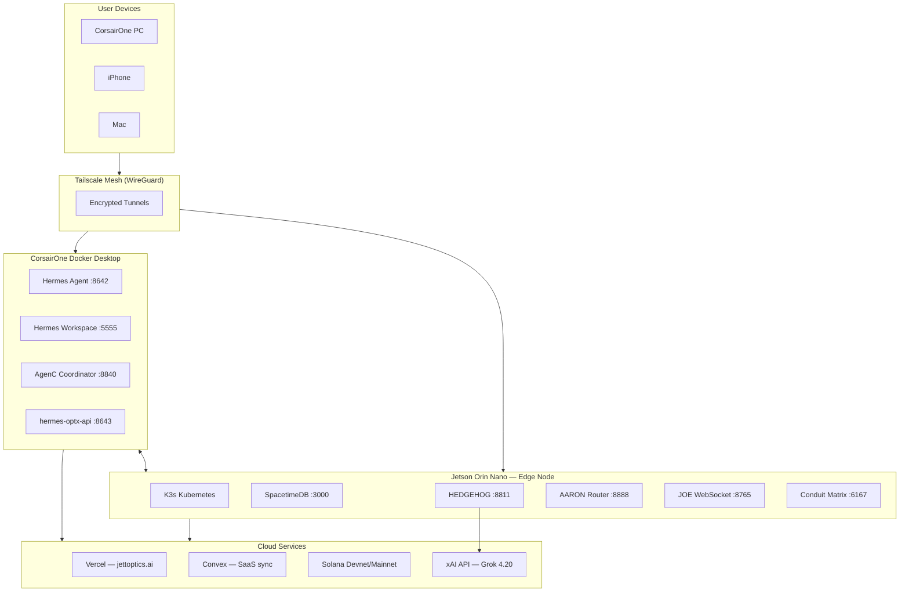

## Infrastructure Topology

## OPTX Validator Node — Edge Services

| Port | Service | Description |
|------|---------|-------------|
| 3000 | SpacetimeDB | Primary edge database (optx-cortex) |
| 8811 | HEDGEHOG | AI gateway (Grok proxy + memory) |
| 8888 | AARON Router | Gaze verification + tensor classification |
| 8765 | JOE WebSocket | Matrix relay for mobile tasking |
| 6167 | Conduit | Matrix homeserver (jettoptics.ai) |

## Orchestration Cluster — Agent Services

| Port | Service | Container |
|------|---------|-----------|
| 8642 | Hermes Agent | astrojoe-brain |
| 5555 | Hermes Workspace | astrojoe-ui |
| 8643 | hermes-optx-api | (planned) |
| 8840 | AgenC Coordinator | optx-agenc |

## Cloud Services

| Service | URL | Purpose |
|---------|-----|---------|
| Vercel | jettoptics.ai | Frontend (Next.js) |
| Convex (prod) | hushed-nightingale-624.convex.cloud | User sync, subscriptions |
| Solana | Helius RPC | On-chain operations |
| xAI | api.x.ai | Grok 4.20 inference |

## Network

All internal communication flows through **Tailscale** mesh networking with WireGuard encryption. Public access points:
- `jettoptics.ai` — Vercel CDN
- `matrix.jettoptics.ai` — Cloudflare Tunnel → Conduit
- `docs.optx.space` — Documentation site

## Related
- [System Architecture](/docs/getting-started/architecture) — High-level overview
- [Edge MCP](/docs/infrastructure/edge) — HEDGEHOG on validator node details
